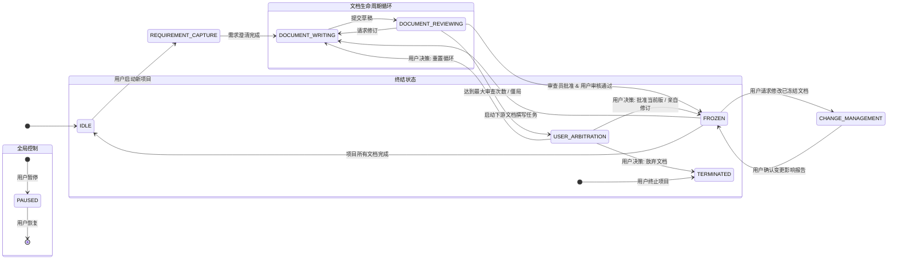

好的，遵照指示。

根据《项目代办事项列表 (V1.0)》，当前的首要任务是为 `L1-DP0: 工作流与状态控制器` 撰写其核心定义文档。

---

### **L1-DP0 工作流状态机定义文档 (V1.0)**

**状态:** 草稿 (Draft)

**版本说明:** 本文档 (V1.0) 是对《公理设计辅助系统 L1 公理设计文档 (V1.1)》中定义的 `L1-DP0 工作流与状态控制器` 的首次详细设计。本文档旨在形式化地定义系统级的核心状态、转换条件及触发事件，为工程实现提供明确依据。

#### **1. 引言**

本文档详细定义了“公理设计辅助系统”的核心工作流状态机。该状态机是 `L1-DP0 工作流与状态控制器` 的核心逻辑实现，负责管理整个文档生命周期（从需求捕获到冻结与变更）的状态流转。

设计依据包括：
*   《软件用户需求文档 (URD) V1.6》中定义的核心流程、角色与用户控制权限。
*   《公理设计辅助系统 L1 公理设计文档 (V1.1)》中对 L1-DP0 的职责定义。
*   《项目代办事项列表 (V1.0)》中对此文档的任务说明。

本文档的目标是提供一个无歧义的、可直接转化为代码实现的状态机模型。

#### **2. 核心状态定义**

以下是系统在项目生命周期中可能处于的核心状态。每个状态都代表了系统在特定时间点的一个稳定阶段。

*   **`IDLE` (空闲)**
    *   **定义:** 系统的初始或最终状态。没有活动项目在进行，系统等待用户发起新项目。

*   **`REQUIREMENT_CAPTURE` (需求捕获中)**
    *   **定义:** 系统正在通过与用户的结构化对话，捕获和澄清初始需求。此阶段的产物是后续撰写《用户需求文档》的稳定输入。(URD 2.2)

*   **`DOCUMENT_WRITING` (文档撰写中)**
    *   **定义:** “撰写员”(L1-DP5) 角色正在活动。系统正在根据上游文档、审查意见或用户批注，生成或修订文档草稿。

*   **`DOCUMENT_REVIEWING` (文档审查中)**
    *   **定义:** “审查员”(L1-DP6) 角色正在活动。系统正在根据审查清单和相关上下文，对文档草稿进行评估，并生成审查意见。

*   **`USER_ARBITRATION` (用户仲裁中)**
    *   **定义:** 自动流程暂停，等待用户进行决策。此状态在发生审查僵局或达到最大审查次数时被触发。(URD 4.3)

*   **`FROZEN` (已冻结)**
    *   **定义:** 一份文档已通过所有审查和用户批准，其版本被锁定，成为下游工作的稳定基准。系统可能正在处理其他文档或等待新任务。

*   **`CHANGE_MANAGEMENT` (变更管理中)**
    *   **定义:** 用户请求修改一份已 `FROZEN` 的文档时进入此状态。系统将执行依赖分析，生成《变更影响报告》，并等待用户最终决策。(URD 3.2)

*   **`PAUSED` (已暂停)**
    *   **定义:** 用户手动暂停了当前流程。所有活动被挂起，等待用户恢复。此状态可以从任何非终结状态进入。(URD 3.1)

*   **`TERMINATED` (已终止)**
    *   **定义:** 项目被用户手动终止。这是一个终结状态，所有项目数据被归档。

#### **3. 状态转换图**

以下使用 Mermaid.js 语法描述核心工作流的状态转换图。

#### **4. 状态转换表**

下表详细定义了每个状态转换的触发条件、系统执行的动作以及最终进入的新状态。

| 当前状态 | 触发事件/条件 | 执行动作 | 下一个状态 | 备注/URD来源 |
| :--- | :--- | :--- | :--- | :--- |
| `IDLE` | 用户启动新项目 | 初始化项目结构（调用 L1-DP1），准备知识库（调用 L1-DP3） | `REQUIREMENT_CAPTURE` | URD 2.2 |
| `REQUIREMENT_CAPTURE` | 结构化需求捕获完成 | 调用 L1-DP5 准备撰写《用户需求文档》 | `DOCUMENT_WRITING` | URD 2.2, 2.3 |
| `DOCUMENT_WRITING` | “撰写员”完成草稿 | 调用 L1-DP7 提交草稿版本 | `DOCUMENT_REVIEWING` | URD 2.3 |
| `DOCUMENT_REVIEWING` | “审查员”请求修订 | 调用 L1-DP7 记录审查意见 | `DOCUMENT_WRITING` | URD 2.3 |
| `DOCUMENT_REVIEWING` | 达到最大审查次数 或 连续2轮僵局 | 挂起当前任务，通知用户 | `USER_ARBITRATION` | URD 4.3 |
| `DOCUMENT_REVIEWING` | “审查员”批准 & 用户最终审核通过 | 调用 L1-DP7 将文档标记为 "frozen" | `FROZEN` | URD 2.3 |
| `USER_ARBITRATION` | 用户决策：批准当前版本 | 调用 L1-DP7 将文档标记为 "frozen" | `FROZEN` | URD 4.3.a |
| `USER_ARBITRATION` | 用户决策：亲自修订（钦定版） | 接收用户修订内容，调用 L1-DP7 将文档标记为 "frozen" | `FROZEN` | URD 4.3.b |
| `USER_ARBITRATION` | 用户决策：重置审查循环 | 为“撰写员”准备新的高优先级指令 | `DOCUMENT_WRITING` | URD 4.3.d |
| `USER_ARBITRATION` | 用户决策：放弃当前文档 | 清理当前文档任务 | `TERMINATED` | URD 4.3.c |
| `FROZEN` | 启动下游文档撰写任务 | 解析上游文档，准备上下文，调用 L1-DP5 | `DOCUMENT_WRITING` | URD 2.4, 2.5 |
| `FROZEN` | 用户请求修改已冻结文档 | 创建临时变更分支，调用 L1-DP7 分析依赖 | `CHANGE_MANAGEMENT` | URD 3.2 |
| `FROZEN` | 所有文档任务完成 | 归档项目 | `IDLE` | - |
| `CHANGE_MANAGEMENT` | 用户确认《变更影响报告》 | 调用 L1-DP7 合并变更，作废受影响文档 | `FROZEN` | URD 3.2.5 |
| `ANY` | 用户命令：暂停 | 记录当前状态和上下文 | `PAUSED` | URD 3.1 |
| `PAUSED` | 用户命令：恢复 | 恢复至暂停前的状态和上下文 | (原状态) | URD 3.1 |
| `ANY` | 用户命令：终止 | 执行项目清理和归档 | `TERMINATED` | URD 3.1 |

#### **5. 与其他DP的交互**

L1-DP0 作为工作流控制器，其核心功能是通过调用其他 L1 DPs 来实现状态转换中的“执行动作”。

*   **调用 L1-DP5 (内容生成与修订引擎):**
    *   在进入 `DOCUMENT_WRITING` 状态时被调用，以生成或修订文档。
*   **调用 L1-DP6 (评审与评估引擎):**
    *   在进入 `DOCUMENT_REVIEWING` 状态时被调用，以审查文档草稿。
*   **调用 L1-DP7 (版本控制与变更服务):**
    *   在每次撰写或审查循环结束时被调用，以提交版本、记录意见。
    *   在文档被批准时被调用，以打上“frozen”标签。
    *   在 `CHANGE_MANAGEMENT` 状态中被核心依赖，以分析依赖和管理变更。
*   **调用 L1-DP8 (用户交互接口):**
    *   所有“用户命令”或“用户决策”的事件均通过 L1-DP8 捕获并传递给 L1-DP0。
*   **依赖 L1-DP1, DP2, DP3, DP4:**
    *   L1-DP0 在协调调用 L1-DP5 和 L1-DP6 时，会确保它们能够通过各自的接口从 L1-DP1 (模板), L1-DP2 (词汇), L1-DP3 (知识), L1-DP4 (仲裁) 获取所需的数据，但 L1-DP0 本身不直接调用这些数据服务。

---
Gemini 2.5 Pro 0605 writer