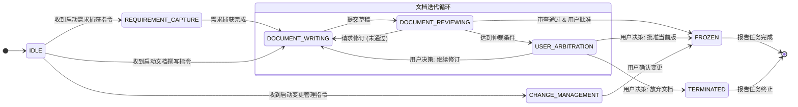

---

### **L1-DP0 工作流状态机定义文档 (V1.1)**

**状态:** 批准(Approved)

**版本说明:** 本文档 (V1.1) 是对 V1.0 版本的 **重大修订**。此修订旨在响应并解决《评审意见：关于<L1-DP0 工作流状态机定义文档 (V1.0)>》中指出的根本性设计缺陷。本次修订的核心目标是：通过重构状态转换逻辑，确保 `L1-DP0` 严格遵循《公理设计辅助系统 L1 公理设计文档 (V1.1)》中定义的 **纯粹协调器** 角色，消除原设计中违反独立公理的耦合问题。

#### **1. 引言**

本文档详细定义了“公理设计辅助系统”的 **文档级生命周期状态机**。该状态机是 `L1-DP0 工作流与状态控制器` 的核心逻辑实现，负责管理 **单份文档** 从创建、撰写、审查、批准直至冻结的完整生命周期。

**设计范围澄清：** 此状态机 **不负责** 项目级的流程管理（如决定下一个要撰写的文档是什么，或判断项目何时结束）。它专注于单个文档的流程，并在完成其生命周期（进入 `FROZEN` 状态）或被终止时结束。项目级的控制逻辑由一个更高层的实体（或 `L1-DP0` 的另一个实例）负责，该实体通过触发此状态机的启动来编排整个项目。

设计依据包括：
*   《软件用户需求文档 (URD) V1.6》中定义的核心流程。
*   《公理设计辅助系统 L1 公理设计文档 (V1.1)》中对 `L1-DP0` 作为纯粹协调器的职责定义。
*   《评审意见：关于<L1-DP0 工作流状态机定义文档 (V1.0)>》中的修订指令。

本文档的目标是提供一个无歧义的、职责清晰的、可直接转化为代码实现的状态机模型。

#### **2. 核心状态定义**

以下是系统在 **单份文档** 的生命周期中可能处于的核心状态。

*   **`IDLE` (空闲)**
    *   **定义:** 状态机的初始状态。等待一个外部指令来启动新的文档任务。

*   **`REQUIREMENT_CAPTURE` (需求捕获中)**
    *   **定义:** 针对特定文档（如《用户需求文档》本身），系统正在通过与用户的结构化对话捕获需求。此状态仅在特定文档类型的生命周期中被激活。

*   **`DOCUMENT_WRITING` (文档撰写中)**
    *   **定义:** 系统已接收到撰写或修订指令。`L1-DP5` (内容生成与修订引擎) 正在活动，根据上游输入生成或修订文档草稿。

*   **`DOCUMENT_REVIEWING` (文档审查中)**
    *   **定义:** 一份文档草稿已提交审查。`L1-DP6` (评审与评估引擎) 正在活动，对草稿进行评估并生成审查意见。

*   **`USER_ARBITRATION` (用户仲裁中)**
    *   **定义:** 自动化流程暂停，等待用户通过 `L1-DP8` 进行决策。此状态在发生审查僵局或达到最大审查次数时被触发。

*   **`FROZEN` (已冻结)**
    *   **定义:** **本文档的生命周期终点**。文档已通过所有审查和用户批准，其版本被锁定。进入此状态后，该状态机实例的工作即告完成，并将“任务完成”事件报告给调用方。

*   **`CHANGE_MANAGEMENT` (变更管理中)**
    *   **定义:** 当外部指令请求修改一份已 `FROZEN` 的文档时，可能会启动一个新的状态机实例进入此状态。`L1-DP7` (版本控制与变更服务) 正在执行依赖分析。

*   **`TERMINATED` (已终止)**
    *   **定义:** **本文档的生命周期终点**。文档任务被用户手动放弃或终止。这是一个终结状态。

#### **3. 状态转换图**

以下使用 Mermaid.js 语法描述 **文档级** 核心工作流的状态转换图。

#### **4. 状态转换表**

下表详细定义了每个状态转换的触发事件、`L1-DP0` 作为协调器执行的 **指令式调用**，以及最终进入的新状态。所有具体的业务逻辑均被封装在被调用的 DP 内部。

| 当前状态 | 触发事件/条件 | 执行动作 (对其他DP的指令式调用) | 下一个状态 | 备注/URD来源 |
| :--- | :--- | :--- | :--- | :--- |
| `IDLE` | 收到启动“需求捕获”任务的指令 | 调用 `L1-DP8` 启动与用户的结构化对话 | `REQUIREMENT_CAPTURE` | 适用于 URD 本身的生成 |
| `IDLE` | 收到基于上游文档的“撰写新文档”指令 | 调用 `L1-DP5`，指令其启动撰写任务 | `DOCUMENT_WRITING` | 适用于下游文档 |
| `REQUIREMENT_CAPTURE` | 收到来自 `L1-DP8` 的“需求捕获完成”事件 | 调用 `L1-DP5`，指令其基于捕获的需求撰写文档 | `DOCUMENT_WRITING` | URD 2.2 |
| `DOCUMENT_WRITING` | 收到来自 `L1-DP5` 的“草稿完成”事件 | 调用 `L1-DP7` 提交版本，并调用 `L1-DP6` 启动审查 | `DOCUMENT_REVIEWING` | URD 2.3 |
| `DOCUMENT_REVIEWING` | 收到来自 `L1-DP6` 的“请求修订”事件 | 调用 `L1-DP7` 记录意见，并调用 `L1-DP5` 启动修订任务 | `DOCUMENT_WRITING` | URD 2.3 |
| `DOCUMENT_REVIEWING` | 收到来自 `L1-DP6` 的“达到仲裁条件”事件 | 调用 `L1-DP8` 向用户发出仲裁请求 | `USER_ARBITRATION` | URD 4.3 |
| `DOCUMENT_REVIEWING` | 收到来自 `L1-DP6` 的“审查通过”及 `L1-DP8` 的“用户最终批准”事件 | 调用 `L1-DP7` 将文档标记为 "frozen" | `FROZEN` | URD 2.3 |
| `USER_ARBITRATION` | 收到来自 `L1-DP8` 的“用户决策：批准”事件 | 调用 `L1-DP7` 将文档标记为 "frozen" | `FROZEN` | URD 4.3.a, 4.3.b |
| `USER_ARBITRATION` | 收到来自 `L1-DP8` 的“用户决策：重置循环”事件 | 调用 `L1-DP5` 启动新的修订任务 | `DOCUMENT_WRITING` | URD 4.3.d |
| `USER_ARBITRATION` | 收到来自 `L1-DP8` 的“用户决策：放弃文档”事件 | 调用 `L1-DP7` 执行文档任务清理 | `TERMINATED` | URD 4.3.c |
| `IDLE` | 收到针对已冻结文档的“变更请求”指令 | 调用 `L1-DP7` 启动变更管理流程 | `CHANGE_MANAGEMENT` | URD 3.2 |
| `CHANGE_MANAGEMENT`| 收到来自 `L1-DP8` 的“变更确认”事件 | 调用 `L1-DP7` 合并变更并更新文档状态 | `FROZEN` | URD 3.2.5 |

#### **5. 与其他DP的交互**

根据《公理设计辅助系统 L1 公理设计文档 (V1.1)》，`L1-DP0` 是一个 **纯粹的协调器**。它 **不直接调用** `L1-DP1` 至 `L1-DP4` 等数据服务，也 **不执行** 任何具体的业务逻辑（如解析文档、准备上下文）。其唯一职责是根据状态转换逻辑，向 `L1-DP5` 至 `L1-DP8` 等功能引擎和服务发送指令。

*   **调用 L1-DP5 (内容生成与修订引擎):**
    *   在进入 `DOCUMENT_WRITING` 状态时被调用，指令其生成或修订文档。
*   **调用 L1-DP6 (评审与评估引擎):**
    *   在进入 `DOCUMENT_REVIEWING` 状态时被调用，指令其审查文档草稿。
*   **调用 L1-DP7 (版本控制与变更服务):**
    *   在文档提交、批准、放弃或变更时被调用，指令其执行版本控制、状态变更和清理归档等操作。
*   **调用 L1-DP8 (用户交互接口):**
    *   触发事件的主要来源。`L1-DP0` 接收来自 `L1-DP8` 的用户决策和命令。
    *   在需要用户输入时（如仲裁），`L1-DP0` 会调用 `L1-DP8` 来触发相应的用户交互。
*   **与其他DP的关系:** `L1-DP0` **不关心** `L1-DP5` 和 `L1-DP6` 如何获取它们所需的数据（如模板、词汇、知识）。根据L1设计，`L1-DP5` 和 `L1-DP6` 会自行通过其接口从 `L1-DP1`, `DP2`, `DP3`, `DP4` 获取所需数据。`L1-DP0` 的关注点被严格分离。

#### **6. 正交状态处理机制 (Orthogonal State Handling)**

某些系统级状态（如 `PAUSED`, `TERMINATED`）与文档的生命周期状态是正交的，它们可以随时中断主流程。它们不应被视为核心生命周期的一部分，而是一种叠加在主状态机之上的全局控制机制。

*   **`PAUSED` (已暂停)**
    *   **触发:** 任何时候，`L1-DP0` 收到来自 `L1-DP8` 的“暂停”命令。
    *   **机制:** 主状态机控制器将保存其当前状态和上下文 `(State, Context)`，并停止响应除“恢复”和“终止”之外的任何事件。
    *   **恢复:** 收到“恢复”命令后，控制器将加载已保存的状态和上下文，并从中断处继续执行。

*   **`TERMINATED` (已终止 - 项目级)**
    *   **触发:** 任何时候，`L1-DP0` 收到来自 `L1-DP8` 的“终止项目”命令。
    *   **机制:** 这被视为一个最高优先级的事件。`L1-DP0` 将立即停止当前所有活动，并进入一个专用的终止流程。
    *   **执行动作:** 调用 `L1-DP7` 执行项目级的清理和归档，并调用 `L1-DP8` 向用户确认项目已终止。此后，所有相关的状态机实例都将被销毁。

---
Gemini 2.5 Pro 0605 writer